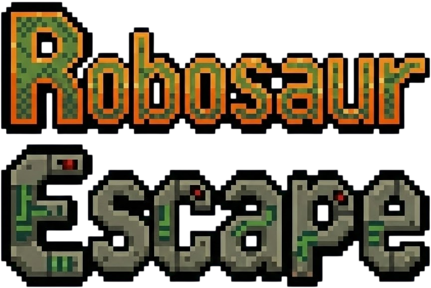

A knockoff of the chrome dinosaur game using DragonRuby.


## Get Started

### Clone the Repo

1.  Open your terminal.
2.  Clone the repository:
    ```bash
    git clone https://github.com/hyrumcarlile/dinosaur-jump.git
    cd dinosaur-jump
    ```

### Run the Game

1.  Navigate to the `dinosaur-jump` directory.
2.  Run the DragonRuby executable:
    - **MacOS**: `./dinosaur-jump/dragonruby`
    - **Windows**: `.\dinosaur-jump\dragonruby.exe`
    - **Linux**: `./dinosaur-jump/dragonruby`

The game window should open immediately.

### Run Unit Tests

To verify the game logic, you can run the test suite:

```bash
./script/test
```

This will execute all unit and end-to-end tests located in `mygame/app/tests`.

## Code Info

The source code for the game is located in `dinosaur-jump/mygame/app`. Here is an overview of the project structure and key concepts:

### Project Structure

- **`mygame/app/main.rb`**: The entry point of the game. It defines the `tick` method, which DragonRuby calls 60 times per second.
- **`mygame/app/scenes/`**: Contains the Scene classes that manage different game states.
    - `MenuScene`: The main menu.
    - `GameScene`: The core gameplay loop.
    - `PauseMenuScene`: The pause overlay.
- **`mygame/app/classes/scenes/game_scene/`**: Contains game objects specific to the gameplay (e.g., `Player`, `Cactus`, `Pterodactyl`).
- **`mygame/app/classes/services/`**: helper classes like `TextRenderer` for sprite-based text.
- **`mygame/app/tests/`**: Contains all unit and E2E tests, mirroring the class structure.
- **`mygame/sprites/`**: Contains all image assets (images, text sprites,UI elements).

### Key Concepts

- **Scenes**: The game uses a scene-based architecture. The `main.rb` file holds a `current_scene` variable. Each tick, it delegates processing to `current_scene.tick`.
- **Tick Method**: The heart of DragonRuby. In every frame (`args.state.tick_count`), we:
    1.  **Calculate**: Update game logic (positions, collisions, input).
    2.  **Render**: Populate `args.outputs` (sprites, solids, labels) to draw to the screen.
- **Inputs**: Player input is handled via `args.inputs` (e.g., `args.inputs.keyboard.key_down.space`).
- **State**: Game state is often stored in instance variables of Scene/Object classes or in `args.state` for global persistence.

### Adding Tests

New tests should be added to `mygame/app/tests`.
1.  Create a new spec file (e.g., `my_feature_spec.rb`).
2.  Define methods starting with `test_`.
3.  Require the file in `mygame/app/tests/tests.rb`.

Example Test:
```ruby
def test_player_jump(args, assert)
  player = Player.new
  player.handle_input(args) # Simulate jump input
  assert.equal! player.action, :jumping
end
```
